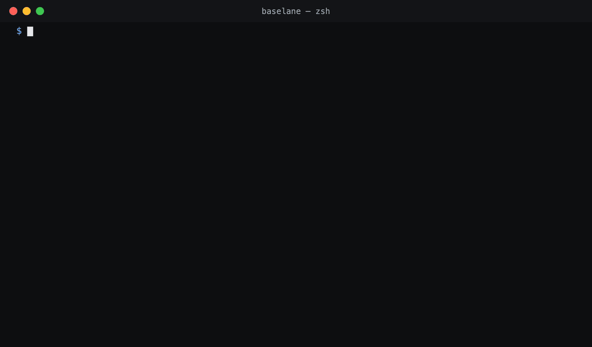

# baselane

**A git-native package manager for AI coding-agent configs.** Version how your team works with Claude Code, Copilot, Cursor, and Gemini — as a declarative `harness.json` manifest plus workflow packs — then audit, render, and distribute it across every repo.

[](https://www.npmjs.com/package/baselane)
[](https://github.com/baselane-sh/baselane/actions/workflows/ci.yml)
[](LICENSE)

[Website](https://baselane.sh?ref=gh) · [Docs](https://baselane.sh/docs/) · [harness.json spec](https://github.com/baselane-sh/harness.json) · [npm](https://www.npmjs.com/package/baselane)



## Why

Every AI harness reads per-repo config — `CLAUDE.md`, `AGENTS.md`, `.github/copilot-instructions.md`, skills, hooks, agents — but there's no equivalent of `package.json` for it. No versioning, no single source of truth, no way for a team to say "this is how we work with AI" and roll it out. Configs drift: stale commands, contradictory conventions, copy-pasted sections nobody updates.

Baselane treats harness config as a versioned artifact:

- **`harness.json`** — a committed manifest, beside `package.json`, declaring which packs at which exact versions a repo (or machine) uses. Written with a [`$schema`](https://baselane.sh/harness.schema.json) key, so your editor validates and autocompletes it.
- **Workflow packs** — validated, versioned bundles of agents, commands, skills, hooks, and conventions, rendered deterministically into every harness's native format.
- **Never-clobber merging** — rendered output merges into files you hand-edit (`AGENTS.md`, `CLAUDE.md`, `~/.claude/settings.json`) via managed regions; your writing is never overwritten.
- **PR-based distribution** — `baselane distribute` opens a pull request with the rendered config instead of pushing to your branches.

## Quickstart

```sh
npm i -g baselane
baselane audit .        # analyze the repo (languages, frameworks, commands), recommend a pack
baselane apply . --pack software-engineer-harness   # render → AGENTS.md + CLAUDE.md/copilot/GEMINI adapters
baselane drift          # detect config drift against the manifest
```

All commands:

```
baselane audit <dir> [--json]
baselane apply <dir> (--pack <id> | --pack-file <path>) [--force] [--dry-run]
baselane distribute <owner/repo> (--pack <id> | --pack-file <path>)
baselane install [github:owner/repo@ref | @scope/name[@version] | owner/repo@skill] [-g]
baselane update [github:owner/repo | @scope/name] [-g]
baselane drift [-g] [--dir <d>] [--json]
baselane publish @scope/name --source github:owner/repo --ref <tag>
baselane draft-pack <dir> · baselane graph <dir> · baselane map <dir>
```

## Guides

Scenario walkthroughs, in the [docs](https://baselane.sh/docs/):

- [Adopt baselane in a repo that already has CLAUDE.md](https://baselane.sh/docs/guide-existing-config.html) — managed regions, never-clobber merging, what happens to your hand-written config
- [Roll out one harness config across a team](https://baselane.sh/docs/guide-team-rollout.html) — pin a pack, distribute by PR, onboard new repos and machines
- [Check harness drift in CI](https://baselane.sh/docs/guide-ci-drift.html) — a one-line GitHub Actions gate on `baselane drift`
- [Install skills straight from GitHub](https://baselane.sh/docs/guide-install-github.html) — vendor obra/superpowers or anthropics/skills at an exact SHA

## Design choices

- **Zero runtime npm dependencies** across the whole monorepo — including the Anthropic API integration (raw `fetch`, no SDK).
- **Deterministic rendering with golden snapshots** — every built-in pack's rendered output is committed and byte-stable; the render pipeline can't drift silently.
- **Exact pins only** — `harness.json` pins pack versions exactly; installs resolve via git + SHA and are tamper-checked.
- **No build step** — Node ≥ 24, ESM, `.ts` sources consumed directly.

This repo manages its own harness config with baselane — see [`harness` files](AGENTS.md) and [`.claude/`](.claude/) for the dogfooded output.

## What's in this repo

| Path | What it is |
|---|---|
| `apps/cli` | The `baselane` CLI — audit, apply, distribute, install, update, drift, publish |
| `apps/agent` | Desktop-agent sync/reconcile engine |
| `packages/packs` | Pack schema, validation (`validatePack`), render pipeline, never-clobber merge |
| `packages/analyze` | Repo static analysis (languages, frameworks, commands) |
| `packages/materialize` | Disk-reconcile + install engine shared by CLI and agent |
| `packages/distribute` | GitHub PR distribution + git-ref pack resolution |
| `docs-site` | Source for [baselane.sh/docs](https://baselane.sh/docs/) |

## Development

```sh
pnpm install
pnpm -r test        # every package's Vitest suite
pnpm -r typecheck   # tsc --noEmit everywhere
```

`AGENTS.md` carries the build commands and non-negotiable conventions.

## Open source & the platform

The CLI, packs, and engines in this repo are Apache-2.0. The org control plane — fleet view of which repos run which pack version, org baselines, governance, drift across laptops — is the commercial product: [join the waitlist](https://baselane.sh?ref=gh).

## License

[Apache-2.0](LICENSE)
